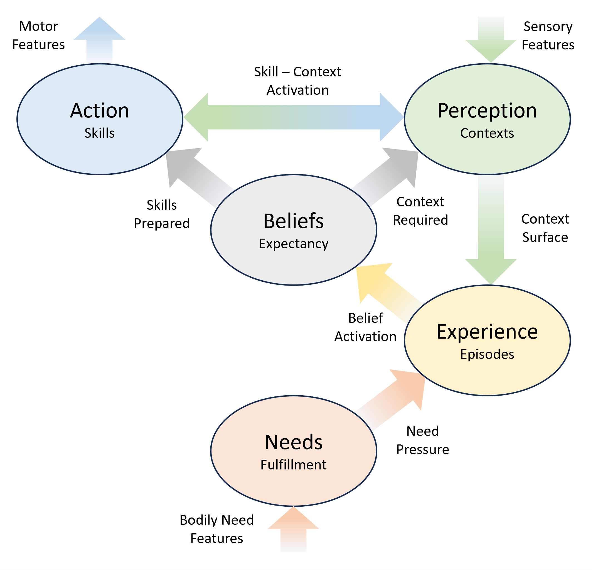

# 4. Model Introduction

The PABEN model describes an agent as a system that must continuously maintain a viable path from its present situation toward what matters. The model does not begin with representation, reasoning, emotion, or consciousness as separate problems. It begins with agency: the problem of how a living or artificial system continues from where it is, through what it can do, toward the regulation and fulfillment of its needs.

The basic assumption is that intelligence is not primarily the manipulation of detached representations. An agent is always already situated in a context, equipped with possible skills, shaped by previous experience, pressured by needs, and guided by expectations about what can happen next. To act intelligently is to keep these dimensions coordinated. When coordination holds, the agent can continue. When coordination breaks, attention, emotion, learning, and reflection are recruited to restore or redirect the path.

The model is organized around five functional domains: Perception, Action, Beliefs, Experience, and Needs (Figure 1). These domains form the acronym PABEN.

    

*Figure 1: The PABEN model domains and inter-domain connections. The world is felt through bodily Need-features, perceived through sensory features, and manipulated through motor features. Need-pressure opens Experience by activating prior episodes with relevant felt need-consequences. Contexts are recognized in relation to available Skill and Belief structures. Experience releases a Belief-field of candidate beliefs with expectancy-contribution toward regulation, avoidance, relief, repair, or fulfillment. Belief-expectancy selects the Belief-intended and prepares the corresponding Skill-structure for release. The belief remains active until a new Context-surface exposes a better belief, or until the current belief breaks.*

Perception is the domain of contexts. It recognizes features, objects, relations, situations, and causes in the world. Perception does not merely create a neutral picture of the environment; it identifies where the agent is or what kind of situation it is in. In PABEN, contexts are not passive descriptions. They are possibility-fields: recognized situations that release and constrain action.

This means that what the agent “sees” is not merely objects, properties, and spatial arrangements. What the agent sees is already structured by possible action. A cup is not only a visible object; it is something that may be reached for, lifted, avoided, filled, offered, thrown, cleaned, or ignored, depending on the active context and need-state. Perception therefore opens the world as a field of possible continuations.

Action is the domain of skills. A skill is not only a motor command, but any executable pattern by which the agent can do something. Skills may be simple bodily movements, learned routines, attentional operations, social behaviors, or complex sequences of action. The Action domain stores what the agent can release and carry out when the right context is present.

Beliefs are the domain of action-beliefs. A belief is not primarily a detached proposition about the world. It is a functional claim that a certain skill can be used in a certain context. In its simplest form, a belief says: “while in this context, this skill applies.” Beliefs therefore bind Perception and Action together. They are the agent’s usable possibilities of action to continue from in a recognized situation.

At any moment, the agent does not have only one possible belief available. The recognized context, together with the active need-state and prior experience, opens a Belief-field: the current field of parallel action-beliefs that could potentially be selected. This field contains the agent’s presently available “ways forward.” Some beliefs may be strong, familiar, and ready for immediate execution. Others may be weak, uncertain, socially blocked, risky, irrelevant, or merely latent. The selected belief is the one that becomes attended, intended, and released into action, but it is selected from a wider field of possible continuations.

The Belief-field is therefore the bridge between seeing and doing. The agent does not first perceive a neutral world and then add action afterwards. Rather, perception, experience, and need together expose a structured field of possible actions. The world appears to the agent as actionable because contexts open beliefs, and beliefs bind those contexts to skills. What is consciously chosen is only the currently dominant or most urgent belief within this larger field.

The Belief-field has a horizon. The Belief-horizon is the highest level of abstraction at which the agent can keep a belief-field stable as a viable expectation toward future valence. It is not merely how far ahead the agent can think in time. It is how abstract a continuation the agent can hold stable while lower-level contexts, skills, and sub-beliefs change beneath it.
A short Belief-horizon limits the agent to immediate and concrete paths toward relief or fulfillment. The agent must act on what is nearby, familiar, directly available, or immediately stabilizing. A longer Belief-horizon allows the agent to maintain expectation through indirect, delayed, or uncertain steps, because a higher-level belief remains stable even while local situations change. In this way, temporal depth follows from abstraction-stability: the more abstract a valence-bearing belief-field the agent can hold stable, the longer and more indirect its expectations can become.

This is essential because the model does not learn meaning from neutral structure alone. It learns from valence backwards. Pain, relief, appetite, satisfaction, threat, and fulfillment mark the marks the beliefs and contexts where the world becomes significant. From these valenced outcomes, Experience can bind what happened before: which context was present, which skill was used, which belief was applied, and what continuation became possible. In this sense, the agent does not first build a complete neutral model of the world and then assign value to it. It discovers valence-bearing situations and builds structure backward from them.

A new belief therefore becomes meaningful only if it can hook into an already known valence-bearing Belief-field. Reflection searches for such hooks: it tries to connect the present unstable or unresolved situation to some known path where fulfillment, relief, avoidance, repair, or continuation has previously been possible. If no hook can be found, the belief may remain empty, speculative, or unusable. If a hook is found, the agent can extend its Belief-horizon: it can now maintain a longer or more abstract path from the present context toward what matters. Reflection must always ensure at least one belief in the belief-field, as the state of no continuation causes expectancy to collapse.

Learning in PABEN follows a conservative and constructive principle. New structure is established through priming, co-activation, and simultaneity. This means that learning is not treated as a detached optimization process. It is bound to attention and guided by emotion. The agent learns where something matters: where expectancy changes, where continuation becomes possible or impossible, where action succeeds or fails, where need-pressure is relieved or intensified. Emotion marks these changes in path viability and thereby helps determine which structures are stabilized, explored, avoided, repaired, or weakened.

In this sense, learning in PABEN is constructive rather than editorial. The agent mostly builds forward by adding and strengthening connections. Old beliefs may become less dominant because newer paths outcompete them, bypass them, or fail to activate them, but the model does not rely on a central mechanism that continuously rewrites its entire structure. More specific mechanisms of emotional updating — including how successful closure strengthens paths and how realized loss can weaken them — are treated in the emotion layer of the model.

Experience is the domain of learned transitions. It records what has happened when beliefs have been used: from which context the agent acted, which belief was applied, what new context or need-state followed, and whether the path became better or worse. Experience is therefore not memory as passive storage, but memory as structured consequence. It allows the agent to open possible continuations from the present context based on previous episodes.

Needs are the domain of pressure, valence, and fulfillment. Needs are what make continuation matter. They include bodily regulation, avoidance, appetite, social dependence, relief, and other fulfillment profiles. A need does not merely request an action; it creates pressure for the agent to find or preserve a path toward regulation or fulfillment. Without Needs, the system could process, represent, or move, but nothing would matter.

These five domains are mutually dependent. Needs create pressure. Experience exposes possible continuations. Beliefs bind contexts and skills into usable action-claims. Perception stabilizes the recognized situation. Action releases and tests the selected skill. The outcome is returned to Experience and evaluated in relation to Needs. In this way, the agent is not a linear input-output machine, but a cyclic system of situated continuation.

The central evaluative variable in the model is expectancy, abbreviated as X. Expectancy is not simply prediction. It is the estimated viability of a possible path. A path has high expectancy when the required context is stable, the required skill can be executed, the experience-structure offers continuation, and the path preserves access to need-regulation or fulfillment. A path has low expectancy when one or more of these conditions becomes unstable, uncertain, blocked, or unavailable.

This gives the model four basic dimensions of path viability. Trustability concerns whether the required context holds. Executability concerns whether the required skill can be executed. Reachability concerns whether the path offers enough continuation from the present situation. Value concerns whether the path preserves access to what matters. Together, these dimensions determine whether a belief is strong enough to guide action.

The Belief-field is continuously evaluated through expectancy. Each available belief has its own path-viability, and the field as a whole defines the agent’s current action horizon. When one belief has sufficiently high expectancy and fits the active need-state, the agent can act fluently. When several conflicting beliefs compete, attention may become unstable or divided. When the field loses expectancy, the agent cannot simply continue and must enter try-observe and reflection processes; it must explore, reflect, wait, ask for help, to form new beliefs.

The agent does not normally calculate all this consciously. Most of the time, it simply continues. A context is recognized, a Belief-field is opened, one belief is dominant, a skill is released, and the agent moves through a familiar action-pattern. This ordinary mode may be called Recognize–Execute. In learned situations, the agent does not need to reflect on every step. Perception and Action are already coordinated through stable beliefs and experiences.

However, continuation can fail or become uncertain. The mechanism is surpriseThe agent may encounter something unexpected, lose the stability of the current context, fail to execute a skill, discover that a path no longer leads onward, or feel that a need has become more urgent. In such cases, expectancy changes. This change is the basis of emotion in the model. Emotion is the felt direction and amplitude of a change in path viability. A positive change in expectancy is felt differently from a negative change; an open possibility is felt differently from a realized outcome or a failed expectation.

Attention is guided by these changes. The agent does not attend to everything equally. Attention is drawn toward the belief, context, skill, or need-state where the unresolved change in expectancy matters most. Within the Belief-field, attention selects the belief whose consequences are most urgent, promising, threatening, unstable, or unresolved. If the path is stable, attention can remain light or embedded in action. If the path becomes unstable, attention tightens around the problem. Consciousness is therefore treated as a limited mode of occupation: the place where the agent must stabilize, redirect, or reconstruct its continuation.

Besides ordinary Recognize–Execute, the model distinguishes two larger process modes. Try–Observe is the process by which the agent holds a context in attention and varies action in order to learn what the context can bear, what changes with action, and which variants belong together. This is the process behind exploration, play, practice, and curiosity. Reflection is the process by which the agent searches for hooks, builds new beliefs, reorganizes paths, or constructs a wider route when the current Belief-field does not contain a sufficiently viable continuation.

The three processes have different roles. Recognize–Execute uses already stabilized context-skill structures. Try–Observe expands and stabilizes local variants by acting and observing. Reflection works on the Belief-horizon, searching for a possible route when no available belief is strong enough. Reflection does not create meaning from nothing; it attempts to connect the present situation to a known or possible valence-bearing field. It is therefore not only problem-solving, but hook-finding into known valence-space.
The model therefore treats intelligence as a continuity problem. The agent must keep moving from actual context to possible continuation, from need-pressure to regulation, from uncertain belief to tested belief, from unstable situation to restored path. Perception, Action, Beliefs, Experience, and Needs are not independent modules that later communicate. They are functional domains in one cycle of agency.

In this cycle, emotion and consciousness are not added on top of cognition. They are consequences of the same architecture. Emotion marks changes in the viability of possible continuation. Attention selects the unresolved place where those changes matter. Consciousness occupies the selected problem until the agent can continue, learn, accept, redirect, or rebuild.
