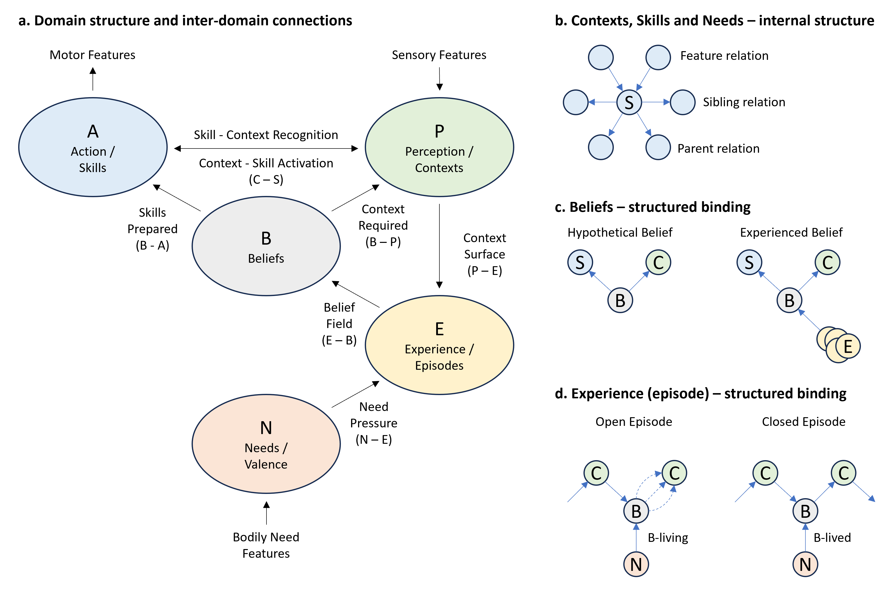

# 6. Formal Foundation
This section defines the static structure of the PABEN model. It describes what the model consists of before the live evaluation and process dynamics are introduced.
The model treats an agent as a growing graph structure. At any time, the agent consists of domains, nodes, edges, and learned transition structures. The structures are activated dynamically during action, attention, learning, and reflection, but the purpose of this section is to define the underlying architecture.
The five domains are:

$$
P,A,B,E,N
$$

where:

$$
P = \text{Percpetion / Contexts}
$$

$$
A = \text{Action / Skills}
$$

$$
B = \text{Beliefs}
$$

$$
E = \text{Experience / Episodes}
$$

$$
N = \text{Needs}
$$

The domains are not independent modules. They are graph domains in one agent architecture. Each domain contains nodes and relations, and the agent develops by establishing and strengthening relations within and between the domains.

## The Agent as a Growing Graph
Let the agent at time  t be described as:

$$\mathcal{A}(t)=(P(t),A(t),B(t),E(t),N(t),\mathcal{R}(t))$$

where $\mathcal{R}(t)$ is the set of learned relations between nodes across the domains.
At $t=0$, the agent contains only minimal primitive capacities:

$$\mathcal{A}(0)=(P_0,A_0,B_0,E_0,N_0,\mathcal{R}_0 )$$

Here, $P_0$ contains primitive context capacity, $A_0$ contains primitive action capacity, and $N_0$ contains primitive need pressure or fulfillment profiles. $B_0$ and $E_0$ contain no developed routes. The agent has not yet learned differentiated context-skill-belief-experience structure.
At t=now, the agent is the accumulated result of its own history:

$$\mathcal{A}(now)=(P_{now},A_{now},B_{now},E_{now},N_{now},\mathcal{R}_{now} )$$

The development from $t=0$ to $t=now$ is the expansion of the agent’s usable structure. Contexts become differentiated. Skills become executable. Beliefs bind contexts and skills. Experience stores transitions. Needs provide felt pressure and felt feedback; Experience binds these need-consequences to learned routes.

The agent’s development is therefore also the expansion of its Belief-horizon: the growing ability to hold more abstract, indirect, and stable routes toward future valence.

## Domains
Each domain is represented as a graph:

$$
P = (\mathcal{C}, \mathcal{R}_P)
$$

$$
A = (\mathcal{S}, \mathcal{R}_A)
$$

$$
N = (\mathcal{N}, \mathcal{R}_N)
$$

$$
B = (\mathcal{B}, \mathcal{R}_B)
$$

$$
E = (\mathcal{E}, \mathcal{R}_E)
$$

where:
$$\mathcal{C}=C_1,C_2,...,C_n$$
is the set of context nodes,
$$\mathcal{S}=S_1,S_2,...,S_m$$
is the set of skill nodes,
$$\mathcal{N}=N_1,N_2,...,N_k$$
is the set of need nodes,
$$\mathcal{B}=B_1,B_2,...,B_l$$
is the set of belief structures, and
$$\mathcal{E}=E_1,E_2,...,E_r$$
is the set of experience structures.

The domain graphs contain internal relations and cross-domain relations. Internal relations define hierarchy, similarity, prerequisite structure, and activation paths inside a domain. Cross-domain relations define how contexts, skills, beliefs, experiences, and needs become connected.

## Context Structure
A context is a recognized situation, object, relation, cause, role, or condition that can matter for action.
Contexts belong to Perception:
$$C_i∈\mathcal{C}$$

The context graph is:

$$P=(\mathcal{C},\mathcal{R}_P )$$

where $R_P$ contains context-context relations such as hierarchy, part-whole relations, feature-context relations, cause-context relations, and parent-child context relations.
A context can be low-level and concrete:

$$C="cold \ surface"$$

or high-level and abstract:

$$C="social \ gathering"$$

The context graph is hierarchical. Lower-level contexts can activate higher-level contexts when they are recognized as belonging together. Higher-level contexts can carry lower-level contexts as supporting structure.
The model distinguishes several context sets.

### Context-total
Context-total is the full set of learned context nodes:

$$C_{total}=\mathcal{C}$$

It is the total context repertoire available in Perception.

### Context-recognized
Context-recognized is the set of contexts currently activated in Perception:

$$C_{recognised} (t)⊆C_{total}$$

A context is recognized when the current perceptual input, persistent context structure, or internal activation is sufficient to activate that context node.
Recognition is belief-recognition in the model. A context matters because it can open, support, constrain, or destabilize beliefs. Perception does not deliver a neutral world-picture to the agent. It delivers recognized contexts that can matter for continuation.
### Context-surface
Context-surface is the top recognition-front of Perception:

$$C_{surface} (t)⊆C_{recognised} (t)$$

It contains the highest currently recognized contexts that have not found an active parent in the present recognition process.
Context-surface is what projects into Experience. It is the context-level visible to E for opening a Belief-field.
If recognition produces:

$$C_1→C_2→C_3$$

and $C_3$ has no active parent, then $C_3$ belongs to $C_{surface} (t)$. The lower contexts remain active as supporting structure, but they do not all project into Experience as independent belief-openers.
### Context-carrier
Context-carrier is the context-vector that supports the currently intended belief:

$$C_{carry} (t)⊆C_{recognised} (t)$$

Context-carrier is not the full recognized context set. It is the part of the recognized context structure that carries the active continuity of the selected belief.
### Context-required
Each belief has context requirements:

$$C_{required} (B_i )⊆\mathcal{C}$$

Context-required is the context structure that must hold for a belief to become usable.
Context-required belongs to the structure of the belief. Context-expected belongs to later live evaluation. The model therefore keeps the static requirement and the dynamic expectation separate.

## Skill Structure
A skill is an executable action-pattern.
Skills belong to Action:

$$S_i∈\mathcal{S}$$

The skill graph is:

$$A=(\mathcal{S},\mathcal{R}_A )$$

where $\mathcal{R}_A$ contains skill-skill relations such as hierarchy, prerequisite structure, sequence structure, part-whole relations, and preparation-release relations.
A skill can be primitive:

$$S="move \ hand"$$

or complex:

$$S="write \ an \ argument"$$

Skills become usable through their relation to contexts and beliefs.
The model distinguishes skill states.
Skill-total
Skill-total is the full set of learned skill nodes:

$$S_{total}=\mathcal{S}$$

### Skill-candidates
Skill-candidates are skills that can become relevant under a recognized context, a belief, or a reflection process:

$$S_{candidates} (t)⊆S_{total}$$

### Skill-prepared
Skill-prepared is the skill structure placed in readiness by a Belief-intended:

$$S_{prepared} (t)⊆\mathcal{S}$$

Skill-prepared does not mean executed. It means that the skill is ready for release if the belief continues to hold.
### Skill-released
Skill-released is the skill structure that is released into action:

$$S_{released} (t)⊆S_{prepared} (t)$$

The model keeps intention in the belief domain. Skills are prepared and released; beliefs are intended.

## Need Structure
Needs are the domain of felt regulatory pressure and feedback.
Need nodes belong to the Need domain:

$$N_i∈\mathcal{N}$$

The need graph is:

$$N=(\mathcal{N},\mathcal{R}_N )$$

A Need is a regulatory profile that can become active as pressure and registered as felt feedback. Needs make paths matter.

A Need can concern bodily regulation, relief, appetite, attachment, social stability, curiosity, repair, or other fulfillment structures.
At time $t$, the active need-state is:

$$N_{pressure} (t)⊆\mathcal{N}$$

The active need-state does not select action directly. It pressures Experience and Belief-selection by making some continuations matter more than others.
Needs do not belong to Perception. Perception can recognize contexts related to a need, but the felt pressure belongs to $N$.
For example:

$$"feeling \ cold"∈N$$

while:

$$"open \ window"∈P$$

## Belief Structure
A belief is an action-belief. A belief is a structural binding between context requirements, skill preparation, and experience references.
In compact form:

$$B_i=(C_{required} (B_i ),S_{prepared} (B_i ),E_{episodes} (B_i ))$$

where:

$$C_{required} (B_i )⊆\mathcal{C}$$

is the context structure required by the belief,

$$S_{prepared} (B_i )⊆\mathcal{S}$$

is the skill structure prepared by the belief,
and

$$E_{episodes} (B_i )⊆\mathcal{E}$$

is the set of realized episodes in which the belief has been used.
In its simplest form, a belief says:

$$B_i:S_i∣C_i$$

This means while this context holds, this skill can be used.
A Belief is not a detached proposition. It is a usable action-claim. It binds Perception and Action into a possible continuation.

However, a belief is not meaningful only because it binds a context and a skill. It becomes meaningful because it has been realized in episodes with need-related consequences. The belief is therefore structurally supported by episodes that connect its use to valence, relief, fulfillment, threat, loss, or continued need-pressure.

The model distinguishes belief sets.
### Belief-total
Belief-total is the full set of learned beliefs:

$$B_{total}=\mathcal{B}$$

### Belief-field
Belief-field is the current set of beliefs that can be selected now:

$$B_{field} (t)⊆B_{total}$$

Belief-field is released from Experience based on Context-surface and active Needs:

$$B_{field} (t)=Release \ ⁡E (C_{surface} (t),N_{pressure} (t))$$

The Belief-field contains the agent’s currently available ways forward.
### Belief-intended
Belief-intended is the belief selected from the current Belief-field:

$$B_{intended} (t)∈B_{field} (t)$$

Belief-intended carries intention and continuity. It prepares skill structure and is supported by a context-carrier.
When a belief is intended, the associated skill structure enters preparation:

$$B_{intended} (t)→S_{prepared} (t)$$

and the associated context requirements define the context-carrier:

$$B_{intended} (t)→C_{carry} (t)$$

## Experience Structure
Experience is the domain of learned transitions through realized episodes.
An experience structure records that a belief was used from a context and led to a resulting context and need consequence.
A basic episode or experience structure is:

$$E_j=(C_{from},B_{lived},N_{felt},C_{to} )$$

where:

$$C_{from}⊆\mathcal{C}$$

is the starting context,

$$B_{lived}∈\mathcal{B}$$

is the belief applied and lived by the agent,

$$N_{felt}⊆\mathcal{N}$$

is the need-related feeling of the belief, and

$$C_{to}⊆\mathcal{C}$$

is the resulting context.

The order matters. The model does not treat Experience as a neutral context transition. Experience records that using a belief in a context changed the agent’s need-state and thereby changed what the resulting context meant.
The core experiential structure is therefore:

$$
C_{from} \overset{B_{lived}(N_{felt})}{\longrightarrow} C_{to}
$$

or, more compact:

$$E_j=(C_{from},B_{lived},N_{felt},C_{to} )$$

This makes the Belief–Need connection explicit inside Experience. A belief becomes experienced as bound to N-felt outcomes; Experience and expectancy later evaluate these as useful, dangerous, disappointing, relieving because its use has been bound to a need-related consequence.

Experience is structured consequence. It stores routes by linking contexts, beliefs, need outcomes, and resulting contexts.

The set of all realized episodes is:

$$\mathcal{EP}=Ep_1,Ep_2,...,Ep_q$$

The Experience domain contains these episodes and their learned relations:

$$E=(\mathcal{EP},\mathcal{R}_E )$$

Experience has three structural roles.
First, it stores realized episodes:

$$E_j=(C_{from},B_{lived},N_{felt},C_{to} )$$

Second, it supports beliefs by connecting them to their realized episode-history:

$$Ep(B_i )=Ep_j∈\mathcal{EP}∣B_{lived} (Ep_j )=B_i$$

Third, it releases possible beliefs into the Belief-field when a relevant Context-surface and Need-state are active:

$$E(C_{surface},N_{pressure} )→B_{field}$$

Experience therefore connects past need-relevant transitions to present possible action.
A belief without episodes can exist as a newly formed or speculative binding, but it has no realized route-strength until it has been used and bound to need-related consequence.

## Cross-Domain Relations
The model depends on relations both inside domains and between domains.
The main structural relations are:

$$C↔C$$

context hierarchy and context association,

$$S↔S$$

skill hierarchy and skill association,

$$C↔S$$

context-skill zip relations,

$$C→E$$

Context-surface projection into Experience,

$$N→E$$

Need pressure into Experience,

$$E→B$$

Belief-field release,

$$B→S$$

Skill preparation from Belief-intended,

$$B→C$$

Context requirements and context-carrier binding,

$$B↔E$$

Belief support by experience references.
These relations form the static basis for the later process descriptions.

## Structure Overview

    

*Figure 2: Static structure of the PABEN-model. The figure summarizes the static architecture used in the formal foundation. (a) The five domains are shown as inter-domain connections: Perception/Contexts (P), Action/Skills (A), Beliefs (B), Experience/Episodes (E), and Needs/Valence (N). Perception exposes a Context Surface to Experience, Needs provide Need Pressure, Experience releases a Belief Field, and an intended belief prepares skills while specifying required context. P and A are coupled through Skill–Context Recognition and Context–Skill Activation. (b) Contexts, Skills, and Needs are represented as internal graph structures with feature, sibling, and parent relations. (c) Beliefs are structured bindings between context and skill. A hypothetical belief is a possible C–S binding; an experienced belief is supported by prior episodes. (d) Experience is represented through episodes. An open episode contains a B-living: a promise that the current context can continue into a possible next context under*

## Context-Skill Zip
The context-skill zip is the structural coordination between Perception and Action.
A context can release or constrain skills:

$$C_i→S_j$$

A skill can lead into or require contexts:

$$S_j→C_k$$

Together they form executable action-continuity:

$$C_i↔S_j↔C_k$$

In learned action, this zip can unfold without reconstructing each step consciously. The zip is the structural basis for fluent Recognize–Execute behavior.

Although the Context-Skill Zip is bidirectional, the two sides have different functional roles. Contexts are continuity-bearing structures. Skills are mobile regulators. A skill preserves, transforms, repairs, exits or searches for a context. A context is the structure in which continuation can hold.

The relation can therefore be read as:

$$
\text{Skill regulates while Context carries continuity}
$$

or, in belief form:

$$
B_i : S_i \mid C_i
$$

This means that the skill is not valuable in isolation. It becomes valuable because it can keep, change or restore a context in which continuation remains possible.

## Belief-field, Belief-horizon, and Belief-blanket
The Belief-field, Belief-horizon, and Belief-blanket are not separate domains. They are structural consequences of the graph.
### Belief-field
The Belief-field is the current set of selectable beliefs released from Experience:

$$B_{field} (t)=B_i∈B∣B_i \ is\ released\ by\  E(C_{surface} (t),N_{actual} (t))$$

It defines what the agent can choose now.
### Belief-horizon
The Belief-horizon is the strategic layer of available continuation. It is the highest level of abstraction at which the agent can hold a belief-route stable as a viable route toward future valence. The Belief-horizon contains experienced routes the agent can hold as possible ways forward:

$$B_{horizon} (t)⊆\mathcal{B}∪\mathcal{E}$$

A high-level route in the Belief-horizon can remain stable even when local contexts, skills, and sub-beliefs require stabilization during execution.
The Belief-field is local and selectable. The Belief-horizon is strategic and route-bearing.
### Belief-blanket
A Belief-blanket is a wider route-field around a problem, need-state, or horizon. It is a set of overlapping beliefs and experience routes that provide possible continuation coverage:

$$B_{blanket} (t)⊆\mathcal{B}∪\mathcal{E}$$

Reflection searches for hooks into a Belief-field or Belief-blanket. A new belief becomes meaningful when it connects the present problem to a valence-bearing route-field.

## Development from $t=0$ to $t=now$
At t=0, the agent has minimal primitive capacities and no developed route structure. At t=now, the agent contains a learned graph of contexts, skills, beliefs, experiences, needs, and cross-domain relations.
The developmental movement can be described as:

$$A(0)→A(now)$$

This movement is the gradual differentiation and connection of:

$$C→S→B→E→N$$

and the reverse structuring from valence N-felt outcomes back into contexts, skills, beliefs, and experience.
The agent’s history is stored as learned structure. Each learned route extends what the agent can recognize, prepare, select, execute, remember, and hold as possible.
The growth of the agent is therefore the growth of its Belief-horizon:

$$B_{horizon} (0)⊂B_{horizon} (now)$$

A larger Belief-horizon means that the agent can hold more abstract, indirect, delayed, and locally unstable routes toward future valence.

## Transition to Live Evaluation
The structures defined here are static only in description. In a living agent, they are continuously activated, evaluated, stabilized, and extended.
At any moment, the agent does not wake into an empty world. It wakes into an already structured field of promises: familiar contexts, available skills, open or latent beliefs, prior episodes, unresolved pressures, and expected routes. This structure is the agent’s current continuity. It is what the agent already “knows how to continue from” before any new reflection begins.

A simple bodily pressure, such as hunger, does not appear as an isolated signal. It enters this already structured field. Hunger activates Need-pressure, Need-pressure opens Experience, and Experience retrieves prior episodes in which food, search, access, delay, frustration, satisfaction, or social provision have been lived. From this, a Belief-field becomes available: possible routes through which the pressure can be regulated or fulfilled.

The next layer of the model introduces the live evaluative variable X, which describes the viability of such possible paths. X evaluates whether a route can hold through context stability, skill executability, reachability, and valencability.

After X is defined, the process layer can describe how Recognize–Execute, Try–Observe, and Reflection operate over the structures introduced here. The purpose of these processes is to keep the agent’s promises live enough for continuity to remain secured: to continue forward when a route holds, stabilize sideways when variants must be learned, and reflect upward when no available belief can yet carry the pressure.
