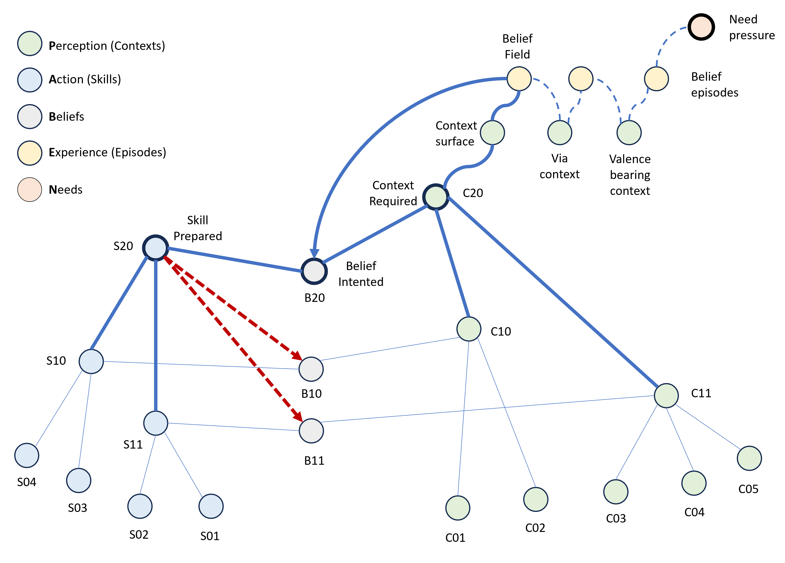

# 8. Process Layer

The static PABEN structure describes what the agent is made of: contexts, skills, beliefs, episodes, needs, and the relations between them. The process layer describes how this structure is used. An agent does not merely contain contexts, skills, and beliefs. It must continuously stabilize a path from the current Context-surface, through possible action, toward contexts in which need-regulation, avoidance, relief, repair, or fulfillment can be reached.

The model distinguishes three stabilizing processes and two disturbing processes. The stabilizing processes are Recognize–Execute, Try–Observe, and Reflection. They correspond to three directions of stabilization: forward, sideways, and upward. Recognize–Execute moves forward through an already available belief-route. Try–Observe moves sideways across variants in order to stabilize context-skill relations. Reflection moves upward into the belief-horizon in order to find or create a new route when the current one cannot carry.

The disturbing processes are Need and Perception. Need disturbs from within by changing felt pressure. Perception disturbs from without by changing the recognized Context-surface. Need says that something must be handled. Perception says that the current world-surface does not carry the belief-field as assumed. Together, these two processes deform expectancy and force the agent either to continue, stabilize, or restructure.

The process layer is therefore governed by one central question: can the current belief still be lived? If yes, Recognize–Execute continues. If the belief can continue but requires variant-stabilization, Try–Observe takes over. If the current route loses coherence, Reflection searches for a new hook. If Need-pressure rises or Perception reveals a destabilizing surface, the system must re-evaluate X and select the process required to preserve continuation.

    

*Figure 3: Process activation and hierarchical cascade in the PABEN-model. The figure shows how a live process is expressed as coordinated activation across Context-surface, Experience, Belief-field, Belief-intention, prepared Skill, required Context, and Need-pressure. The dashed red arrows indicate downward cascade activation, where a higher-level prepared skill primes lower-level belief/skill structures required for execution.*

Figure 3 illustrates how a process is expressed as an activation pattern across the PABEN structure rather than as an isolated module. A current Context-surface is exposed from Perception into Experience, where prior belief-episodes release a local Belief-field. From this field, Belief selects one Belief-intended. The intended belief prepares a skill and specifies the context required for execution. The prepared skill and the required context then form the active context-skill coupling through which Recognize–Execute can proceed.

The red dashed arrows show downward cascade activation. When a higher-level skill is prepared, it can activate lower-level belief/skill structures required for execution. This corresponds to the hierarchical cortico–basal-ganglia style coupling assumed by the model: a high-level intended belief does not explicitly select every sub-action. It prepares a skill-pattern that can cascade into lower-level beliefs and skills, allowing execution to unfold through the context-skill zip.

The upper-right structure shows how Need-pressure enters Experience through prior episodes rather than by pointing directly to contexts. Need-pressure activates episode history, and this history retrieves valence-bearing contexts: contexts that have previously carried lived beliefs with felt need-consequences. The Belief-field is therefore opened from the relation between current Context-surface, prior episodes, and Need-pressure. The selected belief is the route with the strongest current expectancy, X, given Trustability, Executability, Reachability, and Value.

The lower structure shows that prepared skills and required contexts belong to wider skill and context hierarchies. Process stability depends on whether the selected belief can keep its context-skill coupling coherent, whether the downward skill cascade can unfold into the necessary lower-level beliefs, and whether the route remains reachable through Experience toward valence-bearing contexts.

## Recognize–Execute: Forward Stabilization
Recognize–Execute is the forward stabilizing process. It is the ordinary process of living an intended belief through action. The agent recognizes a Context-surface, Experience releases a local Belief-field, one belief becomes Belief-intended, and the prepared skill is released into the required context. The agent does not infer the whole future while executing. It lives the current promise and lets the context-skill coupling carry the episode forward.
The central structure in Recognize–Execute is the context-skill zip. Contexts prepare skills because contexts have historically been places where certain actions could be performed. Skills require contexts because a skill can only be executed if the world-surface provides the relations, objects, positions, timing, and affordances the skill depends on. Recognize–Execute therefore unfolds as a coupled sequence: recognized context prepares skill, skill changes context, changed context releases a new Belief-field, and a new belief can become intended.
In this process, the agent does not need to know a predefined final endpoint. The current belief is lived until the Context-surface changes enough to open another belief that is better, necessary, or forced. At that point, the previous belief closes retrospectively as B-lived. The episode is then stored as a transition:

$$Ep_j=(C_{from},B_{lived},N_{felt},C_{to} )$$

The important point is that C_to does not need to be specified in advance. It is the context-state reached when the agent changes gear. Experience stores the lived transition, not a pre-written script.

Recognize–Execute is fluent when the four components of expectancy remain sufficiently high. Trustability is high when the required context can be held as usable carrier. Executability is high when the prepared skill can be released as the same executable pattern. Reachability is high when the opened Belief-blanket contains a route to the relevant valence-bearing context-field. Value is high when the route matters for need-regulation, avoidance, relief, repair, or fulfillment. When these components hold, the agent continues forward without conscious restructuring.

Recognize–Execute can still involve learning. Each lived episode updates the episode-field from which future expectancy is read. If a belief consistently carries from one context to another and produces stable felt consequences, its route becomes more available. If the same belief repeatedly dissolves into context-breaks, skill-fragmentation, unreached targets, or negative felt consequences, its future X falls. Forward execution is therefore not blind repetition. It is the ongoing production of lived evidence.

## Try–Observe: Sideways Stabilization
Try–Observe is the sideways stabilizing process. It operates when the agent cannot simply continue forward because the relation between context and skill is unstable, uncertain, or insufficiently differentiated. The agent holds one side of the relation in attention and varies the other. It can hold a context and try different skills, or hold a skill and observe which context-variants it can tolerate.

The function of Try–Observe is to reduce uncontrolled variance. A context is not trustable merely because it is recognized. It must be usable as carrier for a belief. A skill is not executable merely because it exists. It must remain the same executable pattern across relevant context-variation. Try–Observe explores the boundary between usable and unusable variants. It discovers which differences matter, which can be ignored, which require correction, and which force a new context or skill distinction.

On the context side, Try–Observe improves Trustability. It learns how a context can be stabilized, controlled, confirmed, or brought back into its usable field. A context has high T when the Belief-field it opens folds back onto the same context-stabilization field. It has low T when the field dissipates into incompatible contexts, repairs, exits, or reclassifications. Try–Observe works on this dissipation. It tests where the context holds, where it breaks, and what actions can keep it usable.

On the skill side, Try–Observe improves Executability. It learns how a skill can remain itself under changing circumstances. A skill has high Q when it can absorb the relevant context-variation and still be released as one coherent action-pattern. It has low Q when it fragments into incompatible variants, corrections, aborts, or sub-beliefs. Try–Observe widens the executable field of the skill by discovering which variations can be integrated.

Try–Observe is therefore the learning process that builds precision. It creates siblings, variants, and usable distinctions in both P and A. It separates prerequisite structure from variant structure. It turns diffuse possibility into controlled possibility. When Try–Observe succeeds, the next occurrence of the same context-skill problem can be handled by Recognize–Execute. What was previously uncertain becomes executable.

Try–Observe also explains curiosity, practice, play, and careful observation within the same mechanism. Curiosity holds a context in attention and asks what it can do, what can be done with it, and how it can be controlled. Practice holds a skill in attention and asks across which contexts it can remain stable. Play loosens immediate consequence pressure and allows the agent to explore variants without every failure becoming a threat to continuation. In all cases, the process is the same: hold, vary, observe, stabilize.

## Reflection: Upward Stabilization
Reflection is the upward stabilizing process. It operates when the current Belief-field cannot carry continuation, when Try–Observe cannot locally stabilize the problem, or when Reachability collapses because the opened Belief-blanket no longer contains a coherent route to a valence-bearing context-field. Reflection is not execution. It is not local variant exploration. It is route-restructuring.

Reflection moves the problem into the belief-horizon. The belief-horizon is the larger structure of known and possible routes that the agent can hold as viable expectation. When the current path breaks, Reflection searches for a hook: a context, skill, belief, episode, analogy, memory, social route, or abstraction that can reconnect the current problem to a reachable promise-blanket.

The reflective loop can be described as a backward activation cycle. A problem-belief activates possible skills. Possible skills imply required contexts. Required contexts activate perceptual and episodic structures. Episodes activate prior lived transitions and valence-bearing context-fields. From these, Experience can release candidate beliefs back into B. Reflection therefore runs through the structure:

$$B→S→C→E→B$$

This loop does not mean that Reflection invents continuation from nothing. It searches the existing and partially formed structure for a new connection. If no ready connection exists, Reflection can create a new hypothetical belief by binding a candidate context and a candidate skill under the pressure of a Need. That belief remains weak until it is lived and closed through episodes.

Reflection is required when the agent cannot get from the current surface to target through the opened route-field. In terms of X, Reflection is called when the system cannot preserve sufficient Reachability, or when T and Q are too unstable for forward execution and sideways stabilization does not yet provide a usable path. Reflection searches above the local route to find another route, a higher-level context, a different skill-set, a social support, an avoidance path, a repair path, or a new interpretation.

Reflection is limited. It cannot hold all possible contexts, skills, and routes at once. It operates through a bounded workspace: a small number of candidate structures can be held, compared, combined, and tested. This limitation is not a defect added to the model. It is part of why Reflection must use hooks. It cannot search the whole graph directly. It must find promising connection points and test whether they reopen a Belief-blanket with usable X.

When Reflection succeeds, the result is not thought as such. The result is a belief that can again be lived. The process has done its work when the agent can return to Recognise–Execute or Try–Observe. Reflection is therefore upward only in order to become forward again.

## Need: Internal Disturbance and Felt Pressure
Need is the internal disturbing process. It begins when the agent’s felt state changes: pain, lack, hunger, fatigue, urge, attachment, tension, danger, relief, loss, or fulfillment pressure. A Need-change does not directly select a context or a skill. It activates Experience and demands that a route be found.

Need does not point directly to a target context. It opens Experience. Experience contains episodes in which contexts have carried lived beliefs with felt need-consequences. Through these episodes, E can retrieve valence-bearing context-fields: contexts where pain, relief, avoidance, regulation, repair, or fulfillment have previously been lived. The active Need therefore creates pressure, while Experience supplies the route-history through which that pressure can become actionable.

Need is disturbing because it changes X. A rising Need can lower the viability of the current belief even if the external Context-surface has not changed. A belief that was adequate while the agent was rested, safe, or socially held may become inadequate under fatigue, hunger, fear, pain, or attachment pressure. The world can remain the same while the route collapses from within.

Need also determines the value of continuation. Without Need, there is no reason for one route to matter more than another. V is not an external reward attached after cognition. V is the degree to which a route carries relevance for regulation, avoidance, relief, repair, or fulfillment. Need supplies the pressure that makes valence-bearing contexts matter.

With multiple active Needs, Experience can open multiple Belief-blankets at once. These blankets may support each other, overlap, compete, or block each other. Stable action requires that active Needs remain covered by reachable route-fields. Under low pressure, the agent can preserve several Needs simultaneously. Under stress, emotional amplitude rises and Need-consideration narrows. The system prioritizes the most urgent blanket and temporarily suppresses other Needs. This produces focus, but it also creates later unresolved pressure when neglected Needs return.

Need therefore acts as the inner source of process-switching. It can pull the agent out of fluent Recognise–Execute, force Try–Observe when regulation requires new control, or call Reflection when no route to relief or fulfillment is available. In emotional terms, Need supplies the pressure that makes a belief-path urgent.

## Perception: External Disturbance and Surprise
Perception is the external disturbing process. It continuously recognizes contexts from sensory features and exposes a Context-surface to Experience. This Context-surface is not a neutral picture of the world. It is the currently recognized field of contexts that can open, support, constrain, destabilize, or block beliefs. Perception matters because it determines which contexts are available for belief-release and which contexts are no longer carrying the current promise.

Surprise occurs when the Context-surface changes in a way that matters for the active Belief-field. Surprise is not mere sensory novelty. A feature is surprising when it enters the surface as belief-relevant: it opens an unexpected belief, blocks an expected route, destabilizes the context-carrier, reveals that the current context was misrecognized, or changes the reachability of the route. Surprise is therefore emotional recognition at the Context-surface.

Perception can disturb the system in several ways. It can reveal that the required context is not present. It can show that the context has shifted into a different variant. It can expose a new object, agent, risk, opportunity, obstruction, or social judgement. It can split a context into a more precise context. It can dissolve a context that previously seemed stable. In all cases, the disturbance matters because the Context-surface no longer supports the same Belief-field or the same promise-blanket.

Perceptual disturbance is closely tied to Trustability. A context has high T when it can be recognized, controlled, and kept within its usable stabilization field as carrier for the belief. When perception shows that the context is dissipating into incompatible variants, T falls. The agent may then continue with correction, enter Try–Observe to stabilize the context, or move into Reflection if no local stabilization is available.

Perception also changes Reachability. A new surface can open a route that was not previously available. It can also close a route that seemed reachable. The agent is not navigating an abstract map. It is navigating a live Context-surface that continuously changes which Belief-fields can be released. A door opening, a person entering, a tool appearing, a path being blocked, or a social signal changing can all reorganize the reachable blanket.

Perception is therefore not passive input. It is the process that keeps the model answerable to the world. Need prevents the agent from ignoring the body and its pressures. Perception prevents the agent from ignoring the external surface that must carry action. Together, Need and Perception deform X. The stabilizing processes respond by moving forward, sideways, or upward until a belief can again be lived.
